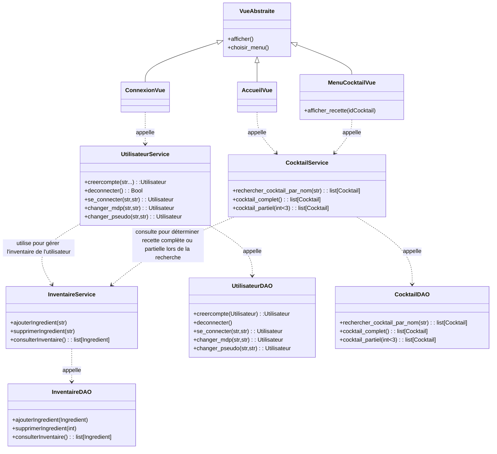

# Diagramme de classes orienté business (DAO et service )

Dans ce diagramme, nous avons  mis en avant la partie **business** de l'application.  
On y retrouve les **DAO** et les **services**.
L’idée ici, c’est de montrer quelles sont les **méthodes** que nous utilisons.  

Ce diagramme est codé avec [mermaid](https://mermaid.js.org/syntax/classDiagram.html) :

* avantage : facile à coder
* inconvénient : on ne maîtrise pas bien l'affichage

Pour afficher ce diagramme dans VScode :

* à gauche aller dans **Extensions** (ou CTRL + SHIFT + X)
* rechercher `mermaid`

  * installer l'extension **Markdown Preview Mermaid Support**
* revenir sur ce fichier

  * faire **CTRL + K**, puis **V**

